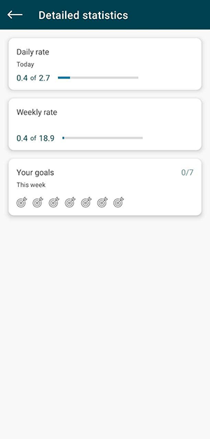

# Aquent

The application keeps statistics on water consumption. 
First you need to go through a small registration, where you need to specify the weight and name. 
The user can then keep records of water consumption. 
You can also see the amount of alcohol consumed per day and week. 
There are some more functions according to the type of goals accomplished for the day.

The database clears itself after a week.

I used Room and tried to keep the architecture clean also I used the principles of material design, 
viewmodel, coroutines, view binding, solid principles.

